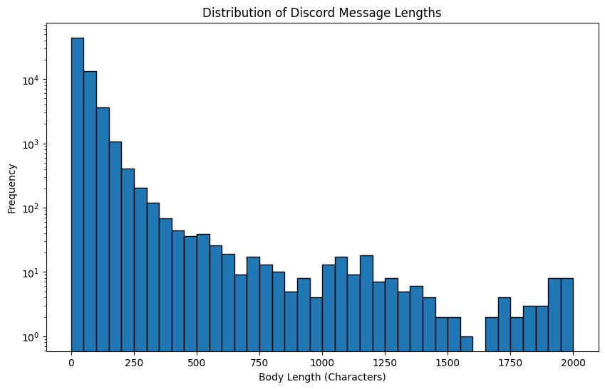
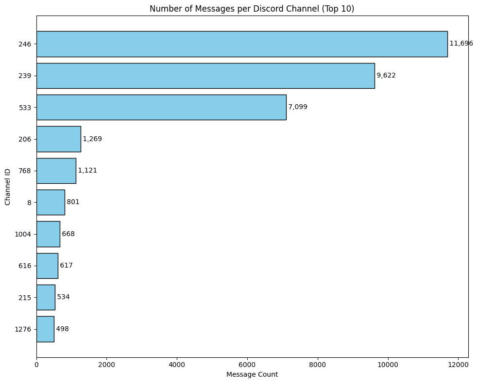
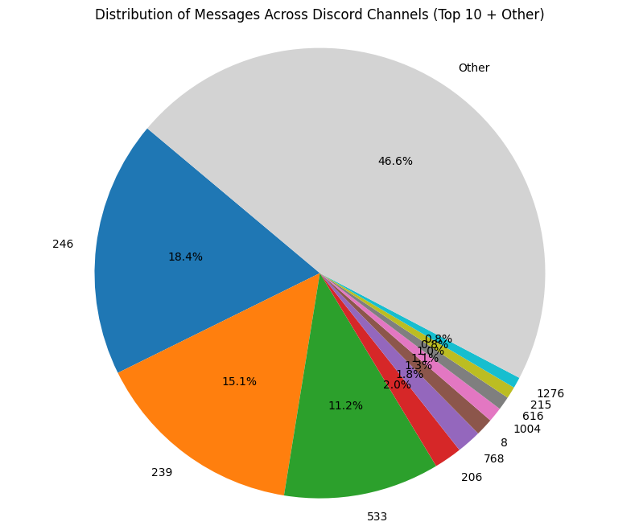
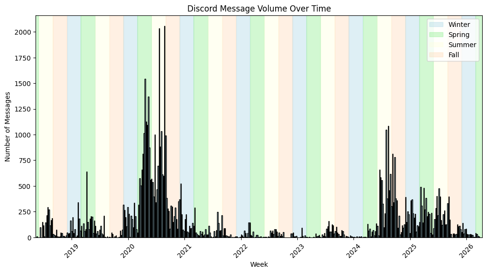
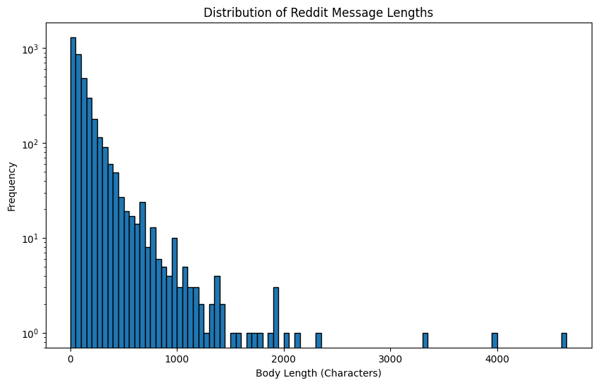
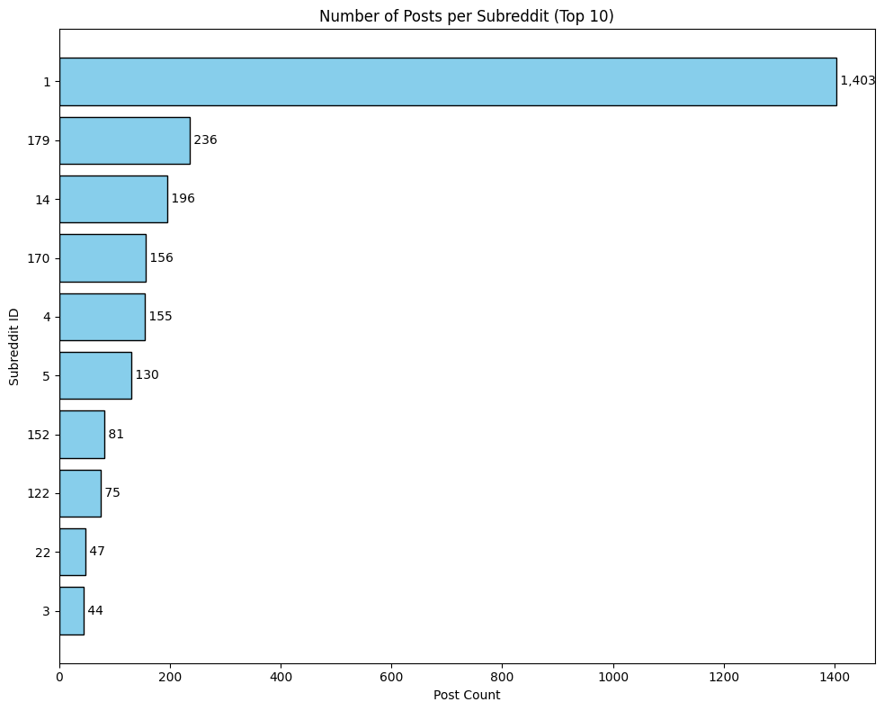
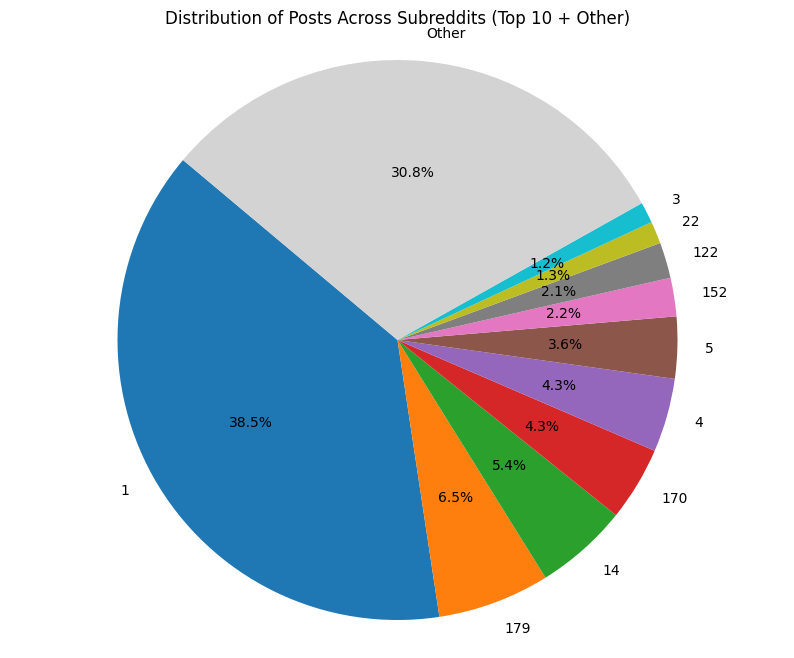
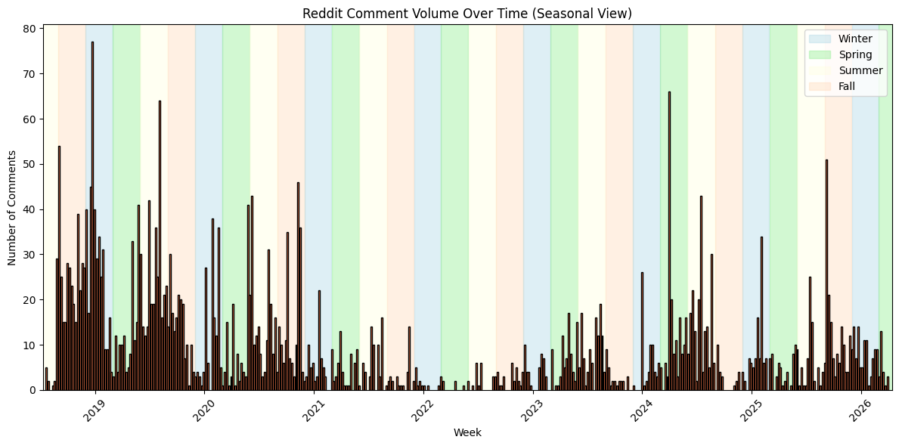
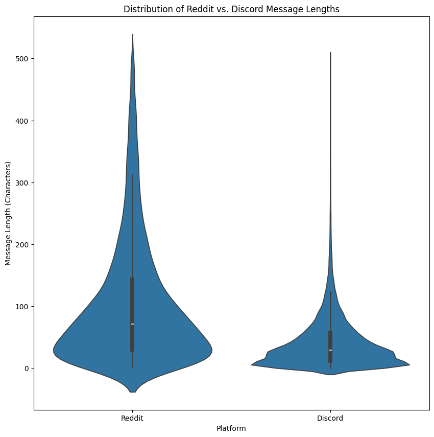

# DSA210 Project

Ömer Rıfat Kuldaşlı

## Overview

The goal of this project is to analyse my personal usage data from several online platforms between 2018 and 2026 and identify potential patterns in this data. These patterns may include recurring time-based changes in usage (for example, during certain seasons or after a certain year). The data also includes text content of my messages and posts, so perhaps the average length of my content may have changed over the years.

## LLM Usage Disclosure

LLMs (specifically those provided by Google Gemini) were used to assist with this project, mostly for writing matplotlib/pandas code. See the `llm/` folder for full LLM conversations. The conversations were archived as HTML files and can be opened with a web browser.

## Motivation

I have been very active on these platforms for a very long time, yet I have never really looked back and analyzed the data I've published on these platforms over time. I thought the DSA210 project assignment would be a good opportunity to collect all of this data I've created and inspect it at a macro scale.

## Data Sources

| Name | Data Range | Contents | Collection Method |
| --- | --- | --- | --- |
| Personal Reddit Data | 2018-2026 | Post and comment data (timestamp, subreddit, text content) | Data request |
| Personal Discord Data | 2018-2026 | Messages (timestamp, server, channel, text content) | Data request |

All of the data I need can be requested directly from the respective platforms as JSON and/or CSV files.

## Anonymization

The original data I retrieved included exact data including unique IDs for posts, channels, servers, users, etc., exact message and post contents, attachment data, profile pictures, email addresses, IP addresses, and a lot of other PII that was not relevant to the project and should remain private. Because of this, before analyzing the data, I performed the following steps to anonymize the data:

1. Identified the files containing data related to Reddit posts and Discord messages
2. Anonymized unique IDs (message IDs, channel IDs, post IDs, subreddit IDs) to be unique, increasing numbers starting from 1.
3. Stored the mappings from channel and subreddit IDs to names/real IDs in separate files for future reference.
4. Replaced exact text content with message/post lengths.

The exact code that accomplishes these steps is shown in [01_eda.ipynb](01_eda.ipynb).

## Data Analysis

### Exploratory Data Analysis

*(See [01_eda.ipynb](01_eda.ipynb) for the code used and their outputs.)*

I used a variety of chart types and categories to analyze the data from both platforms.

**Analysis of Discord data**

Preliminary analysis of my Discord data showed that my messages in 3 channels (all in the same server) accounted for almost 45% of my Discord activity. It also showed that I had a tendency to use Discord more during summer compared to other seasons of a given year.









**Analysis of Reddit data**

Preliminary analysis of my Reddit data showed that activity in just one subreddit accounted for more than a third of my activity on Reddit. There wasn't a clear pattern for my activity between seasons. It seemed like while most of my posts were short in length, I also had plenty of longer posts.









**Side-by-side comparison of text length**

The side-by-side violin plots of my Discord message length data and my Reddit post length data showed that my Reddit posts had a larger variance in text length, while my Discord messages were much shorter in comparison.




### Hypothesis Testing

*(See [02_hypothesis_testing.ipynb](02_hypothesis_testing.ipynb) for the code used and their outputs.)*

I used Chi-Square Goodness-of-fit and One-Way ANOVA tests to verify statistically that in 2023, my Discord messages were not evenly distributed across seasons, and that I had sent more messages in summer compared to other seasons.

```
--- Chi-Square Goodness-of-Fit (Total Volume) ---
Total Messages by Season:
season
Summer    804
Autumn    475
Winter    163
Spring    101
Chi-Square P-Value: 6.6959e-176
Result: Reject H0. The total messages are NOT uniformly distributed.
```

```
--- One-Way ANOVA (Daily Averages) ---
Average Daily Messages - Summer: 12.4
Average Daily Messages - Winter: 7.8
Average Daily Messages - Spring: 4.8
Average Daily Messages - Autumn: 9.1
ANOVA P-Value: 5.7661e-02
Result: Reject H0. The daily averages vary significantly by season.
```

```
Data is not uniform, and Summer is statistically the most active season.
```

### Machine Learning

*(See [03_ml_supervised_learning.ipynb](03_ml_supervised_learning.ipynb) for the code used and their outputs.)*

I split my Reddit post data to three equally sized bins (Short, Medium, Long posts) and built a Random Forest (supervised learning) model that predicts the length of a post using the subreddit ID, time of day and week of the day. The results revealed that average accuracy of the trained model was above 33% (more precisely, it was 43%). This indicates that these attributes can indeed increase the odds of correctly identifying the length of a post. The results also correctly showed that the model was more likely to be correct when identifying the length of a post if the posts on a subreddit are generally very short.

```
--- Model precision based on test data ---
              precision    recall  f1-score   support

        Long       0.44      0.49      0.47       231
      Medium       0.36      0.37      0.36       243
       Short       0.49      0.44      0.47       255

    accuracy                           0.43       729
   macro avg       0.43      0.43      0.43       729
weighted avg       0.43      0.43      0.43       729
```

```
--- Features that are most important for determining the comment length ---
hour                0.386682
weekday             0.177826
subreddit_id_170    0.017550
subreddit_id_179    0.016464
subreddit_id_14     0.013620
dtype: float64
```

## Limitations and future work

The anonymization method used prevented some types of analysis that could have been useful:

- Anonymized Discord data only includes channel IDs, not server IDs. This prevented the data analysis from considering a server as a whole.
- Similarly, anonymized message/post data only includes text lengths, not the number of newlines or data about the markdown used. This could have been an interesting metric to differentiate serious posts from casual posts.

Future work could improve the data preparation step to include more data while preserving the anonymity of the source to perform more in-depth analysis of the data.
